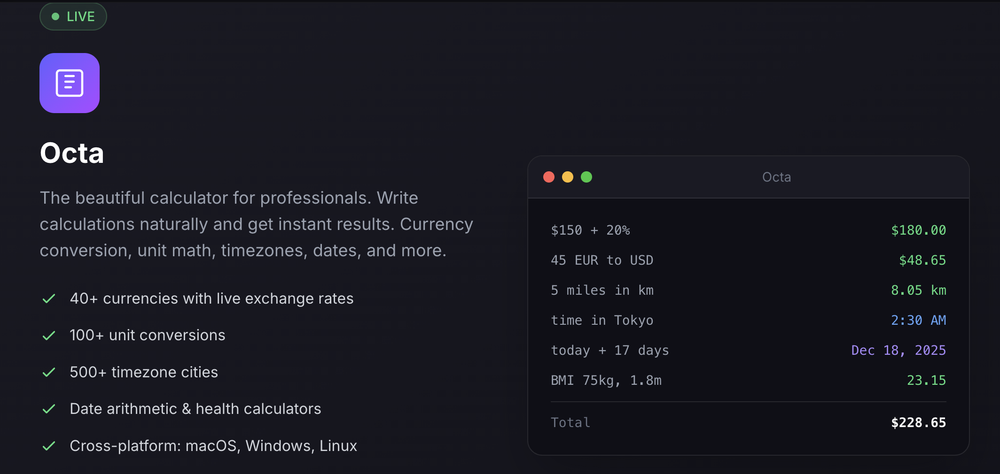
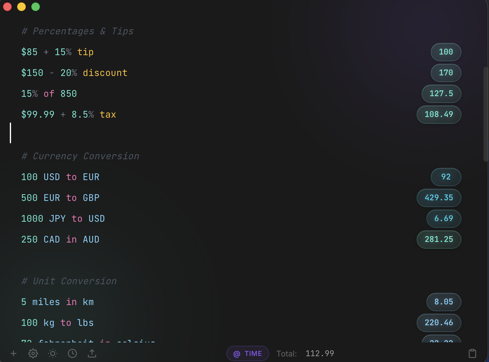

# Octa

**The powerful text-based calculator for professionals.**

Write calculations naturally and get instant results. Currency conversion, unit math, percentages, and more.

## License Activation

## Features

- **Natural Language** - Write `$85 + 15% tip` and get results instantly
- **40+ Currencies** - Live exchange rates, `100 USD to EUR`
- **100+ Units** - Length, weight, time, data: `5 miles in km`
- **Percentages** - `$150 - 20% discount`, `15% of 850`
- **Variables** - Define and reference values across lines
- **Session History** - Your calculations persist across sessions

## Download

Get the latest version from the [Releases](https://github.com/Moshiour027/octa-releases/releases) page.

| Platform | Download |
|----------|----------|
| macOS (Apple Silicon) | [Octa_0.1.0_aarch64.dmg](https://github.com/Moshiour027/octa-releases/releases/latest/download/Octa_0.1.0_aarch64.dmg) |
| macOS (Intel) | [Octa_0.1.0_x64.dmg](https://github.com/Moshiour027/octa-releases/releases/latest/download/Octa_0.1.0_x64.dmg) |
| Windows | [Octa_0.1.0_x64_en-US.msi](https://github.com/Moshiour027/octa-releases/releases/latest/download/Octa_0.1.0_x64_en-US.msi) |
| Linux | [Octa_0.1.0_amd64.deb](https://github.com/Moshiour027/octa-releases/releases/latest/download/Octa_0.1.0_amd64.deb) |

## License

Octa requires a license key to activate.

**Price:** $25 one-time (lifetime license)

[Purchase Octa](https://techyowls.lemonsqueezy.com/buy/a565d154-17a0-442a-96cd-03fc7b1c0c55)

- One-time purchase, no subscription
- All features included
- Use on up to 2 devices
- Lifetime updates

## Support

- Website: https://octa.techyowls.io
- Email: contact@techyowls.io

---

Made by [TechyOwls](https://techyowls.io)
